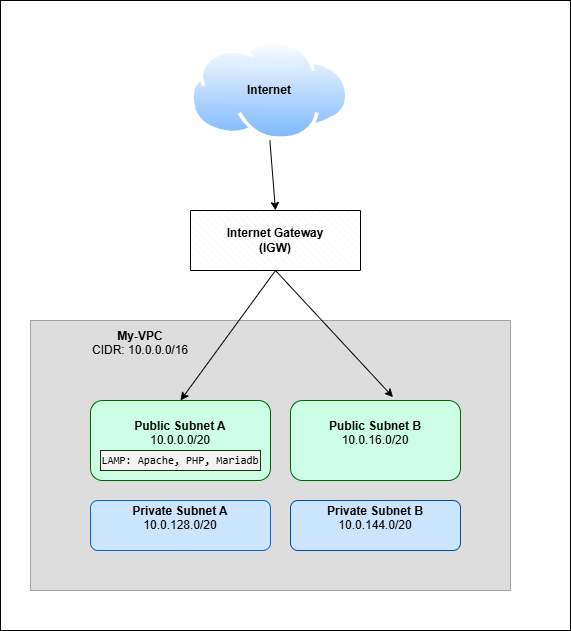
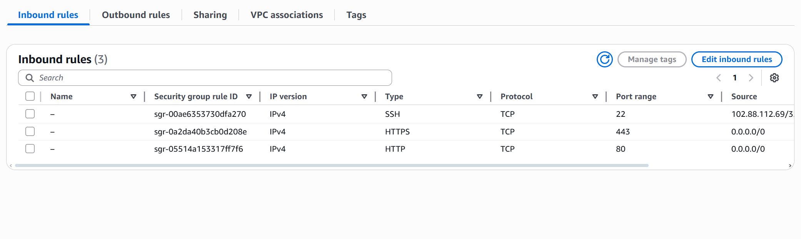
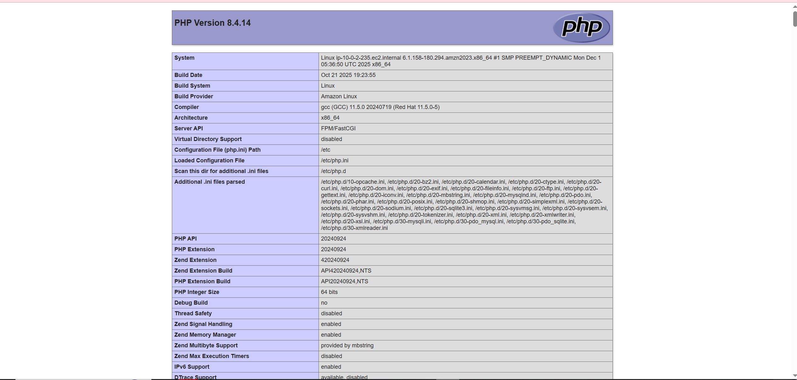

# LAMP Server Deployment on AWS (Amazon Linux)

## Project Overview

This project demonstrates **end-to-end deployment of a LAMP stack on AWS**, including **VPC, subnets, EC2, security, and PHP application hosting**.  
The goal is to showcase **cloud infrastructure, Linux administration, and web hosting skills** through a portfolio-ready, real-world project.

---

## Project Objectives

- Deploy a functional **LAMP stack** on EC2
- Configure a **custom VPC** with public and private subnets
- Implement **Security Groups** for least-privilege access
- Test PHP application accessibility
- Document the deployment workflow for portfolio and interview purposes

---

## Technologies Used

- **AWS:** EC2, VPC, Subnets, Internet Gateway, Route Tables
- **OS:** Amazon Linux 2023
- **Web Server:** Apache (httpd)
- **Database:** MariaDB (MySQL-compatible)
- **Backend Language:** PHP
- **Version Control:** GitHub
- **CLI:** Git Bash

---

## Architecture Overview

- **VPC:** Custom CIDR 10.0.0.0/16
- **Public Subnets:** 2 (for internet-facing resources)
- **Private Subnets:** 2 (for backend/future expansion)
- **Internet Gateway:** Enables HTTP/HTTPS access
- **Route Tables:** Properly configured for routing
- **EC2 Instance:** Amazon Linux, t3.micro, deployed in public subnet
- **Security Groups:** Least-privilege inbound/outbound rules



---

## Security Configuration

- **Inbound Rules:**
  - SSH (22) → My IP only
  - HTTP (80) → 0.0.0.0/0
  - HTTPS (443) → 0.0.0.0/0
- **Outbound Rules:** All traffic allowed

[

---

## EC2 Instance Setup

- **AMI:** Amazon Linux
- **Instance Type:** t3.micro
- **Subnet:** Public Subnet

### Connecting to the Instance

```bash
ssh -i <key-pair-name>.pem ec2-user@<ec2-public-ip>
```

---

## LAMP Stack Installation

```bash
# Update System Packages
sudo yum update -y

# Install LAMP Server

sudo dnf install -y httpd wget php-fpm php-mysqli php-json php php-devel

#Install MySQL (MariaDB)

sudo dnf install mariadb105-server -y

# Permissions

## Added ec2-user to Apache group.

sudo chmod -a -G apache ec2-User

## Logged out and in to verify group membership

exit

ssh -i <key-pair-name>.pem ec2-user@<ec2-public-ip>

groups

## Changed ownership of /var/www and its content from ec2-user to Apache.

sudo chown -R ec2-user:apache /var/www

## Added group write permission

sudo chmod 2775 /var/www && find /var/www -type d -exec sudo chmod 2775 {} \;

find /var/www -type f -exec sudo chmod 0664 {} \;

# Application Deployment


## PHP Test File
echo "<?php phpinfo(); ?>" > /var/www/html/phpinfo.php

## Verify LAMP server is accessible in a browser using

http://my.public.dns.amazonaws.com/phpinfo.php

```

[

## Testing and Validation

- Validated inbound access rules with SSH
- Verified Apache is running via Chrome browser
- Verified LAMP server (PHP) is running correctly via Chrome browser

---

## Challenges and Solutions

**Opera Mini timeout:** Mobile browsers with proxies may not access EC2 reliably

**Security awareness** Applied least-privilege rules, removed sensitive test files.

---

## Conclusion

This project demonstrates hands-on experience with AWS infrastructure, Linux server administration, and LAMP stack deployment. It reflects real-world cloud practices and serves as a strong foundation for more advanced architectures.

---

## Author

Maria
